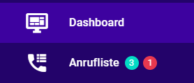

# Technologie Stack
1. Laravel - https://laravel.com
	- composer https://getcomposer.org
2. Nuxt - https://nuxtjs.org
	- Vue - https://v2.vuejs.org/
	- Vuex - store - https://vuex.vuejs.org/guide
	- Vuetifyjs - https://nuxtjs.org/docs
	- axios - https://axios.nuxtjs.org/usage/
	- icons - https://icon-sets.iconify.design/mdi/list-status/

# SETUP
0. Git clone
	- datenbank - git clone "M:\WEB\Lead Wiesel\Umsetzung\lw2-container.git"
	- backend - git clone "M:\WEB\Lead Wiesel\Umsetzung\lw2-backend.git"
	- frontend - git clone "M:\WEB\Lead Wiesel\Umsetzung\lw2-frontend.git"

1. lw2-container, die Datenbank starten
	- der Ordner eintreten
	- docker-compose up
2. 

## DATA EINTRAGEN
Anrufliste
	- In der sales Tabelle muss ich next_call Spalte ändern. User_id, für die Eintrag, soll 313 sein.

Eine SQL Kommand um die Einträge automatisch zu wechseln
	- **docker exec -it lw2-container_db_1 bash** - docker container eintretten
	- **psql -l** - zeig eine Liste von Datenbanken
	- **psql -d leadwiesel2 -U root -W** - die Daten Bank einzulogen
	- **postgres** - passwort
	- **\d** - zeig jede Tabelle in einem Schema
	- **update sales m set user_id = 313, next_call = (select a.created_at from sales a where a.id = m.id) where id < 11700;** - update Eintrage

## LARAVEL
apiResource - welche Endpunkte fugt apiResource hinzu
https://stackoverflow.com/questions/54721576/laravel-route-apiresource-difference-between-apiresource-and-resource-in-route

## NUXT
- nuxt 2.15.8 benutzt noch Vue 2 :/
- probleme mit Rerendering
	- Vue 2 macht kein Rerendering, wann Array oder Object wechseln sich, aber gibt es eine Lösung
	- https://michaelnthiessen.com/debugging-guide-why-your-component-isnt-updating/

## TODO
- Erstell eine neue Sektion "Erledigt" mit erledigte Anrufe unten alle schon bestehende Sektione
- Warum die Tasten sind in aderer Reihenfolge?
	- 
- Warum eine Taste ist außen v-container?
	- 

### Anrufliste
- Wenn man auf der Liste klickt, offnet es sich nicht mehr, nur Knopf [x]
- Zeitzone [x]
	- axios wechselt immmer die Zeit zu UTC, deswegen hat es 2 Stunden subtrahiert
	- https://www.php.net/manual/en/datetime.settimezone.php
	- Jetzt wechsle ich die Zeitzone in PHP
- Das ID von <v-expansion-panel> ist automatisch 0, 1, 2..., deswegen, wenn man mehr als ein expansion-panel hat, muss man mehr als ein v-model hat [x]
	- das :key macht keine Unterschied
	- habe ich ein Object erstellt 
		{
			"2019-06-03": [0, 1],
			"2020-01-14": [0]
		}

### AUF ANRUFLISTE

LOG

- 07.07.2022
	1. Wenn ich zu der Anrufliste Einträge hinzufuge, die schon da sind, werden sie nicht hinzugefügt.

- 11.07.2022
	1. Die Punkte mit der Anzahl der Anrufe "Zu terminieren" und "Zu früh" wurden hinzugefügt.  
	

- 12.07.2022
	1. Eine Datei mit Constants erstellt

- 13.07
	1. Wenn man jetzt eine Eintrag löscht, gibt es ein Dialog mit einer Frage, ob der Benutzer sicher ist, dass er die Eintrag löschen will.
		- vue scoped slots (https://v2.vuejs.org/v2/guide/components-slots.html#Scoped-Slots)